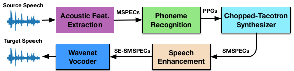
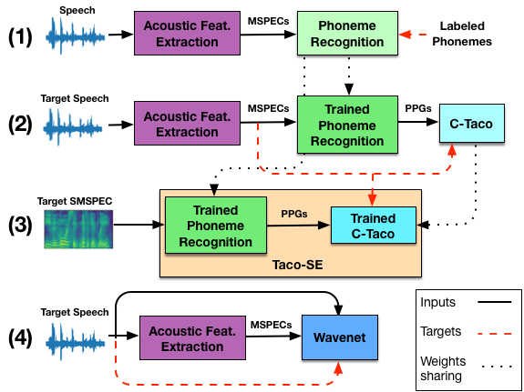

## Taco-VC: A Single Speaker Tacotron based Voice Conversion with Limited Data ##

In this page you will find a short description of the Taco-VC system. 
Taco-VC is a four stages architecture for high quality, non-parallel, many-to-one voice conversion. 
The paper can be found here - TODO

#### Voice Conversion
The purpose of voice conversion (VC) is to convert the speech of a source speaker into a given desired target speaker. 
A successful conversion will preserve the linguistic and phonetic characteristics of the source audio while keeping naturalness and similarity to the target speaker.

#### Taco-VC Architecture
Phonetic Posteriorgrams (PPG) are being extracted from a phoneme recognition (PR) model to preserve the prosody of the source speech  
Using a chopped Tacotron (C-Taco), we synthesize the target Mel-Spectrograms (MSPEC) directly from the PPGs. 
The synthesized MSPECs (SMSPEC) are passed through a speech enhancement network (Taco-SE), which outputs the speech enhanced SMSPECs (SE-SMSPEC). 
Finally, a Wavenet vocoder is used to generate the target audio from the SE-SMPSECs. 
We use the same acoustic features (80-band MSPECs) in our different networks. 

#### Conversion Process

#### Training Process

#### Audio Samples

The following target and source audio samples are from the VCC'18 SPOKE task [1]. 
The training set we use for reference includes two males and two females target speakers. 
Each speaker has the same 81 content utterances for training, and 35 utterances for testing. 
The whole training set is approximately 5 minutes of speech. 
The target speakers are two males (VCC2TM1, VCC2TM2) and two females (VCC2TF1, VCC2TF2).  
The source speakers are two males (VCC2SM3, VCC2SM4) and two females (VCC2SF3, VCC2SF4).  

The converted utterances are being generated by adapting the Taco-VC to the target speaker. 
The training is done only the target speaker training data, Taco-VC is not trained on the source speaker. 

In the following samples you can here 4 conversions per each target. 
The two converted audio files are the output of the following:
<ul> Taco-VC      – Our proposed method, including the Taco-SE (speech enhancement) network</ul> 
<ul>  Taco-VC-NoSe – Our proposed method without the Taco-SE network.</ul> 

##### Target - Female VCC2TF1 , Source - Female VCC2SF3
 <table>
  <tr>
    <td><b>Source</b> <audio controls><source src="samples/F1/30005_F3.wav"></audio></td>
    <td><b>Target</b> <audio controls><source src="samples/F1/30005_F1.wav"></audio></td>
  </tr>
  <tr>
  <td><b>Taco-VC</b> <audio controls><source src="samples/F1/30005_F3_vc.wav"></audio></td>
  <td><b>Taco-VC-NoSe</b> <audio controls><source src="samples/F1/30005_F3_syn.wav"></audio></td>
  </tr>
</table>

##### Target - Female VCC2TF1 , Source - Female VCC2SF4
 <table>
  <tr>
    <td><b>Source</b> <audio controls><source src="samples/F1/30032_F4.wav"></audio></td>
    <td><b>Target</b> <audio controls><source src="samples/F1/30032_F1.wav"></audio></td>
  </tr>
  <tr>
  <td><b>Taco-VC</b> <audio controls><source src="samples/F1/30032_F4_vc.wav"></audio></td>
  <td><b>Taco-VC-NoSe</b> <audio controls><source src="samples/F1/30032_F4_syn.wav"></audio></td>
  </tr>
</table>

##### Target - Female VCC2TF1 , Source - Male VCC2SM3
 <table>
  <tr>
    <td><b>Source</b> <audio controls><source src="samples/F1/30012_M3.wav"></audio></td>
    <td><b>Target</b> <audio controls><source src="samples/F1/30012_F1.wav"></audio></td>
  </tr>
  <tr>
  <td><b>Taco-VC</b> <audio controls><source src="samples/F1/30012_M3_vc.wav"></audio></td>
  <td><b>Taco-VC-NoSe</b> <audio controls><source src="samples/F1/30012_M3_syn.wav"></audio></td>
  </tr>
</table>

##### Target - Female VCC2TF1 , Source - Male VCC2SM4
 <table>
  <tr>
    <td><b>Source</b> <audio controls><source src="samples/F1/30020_M4.wav"></audio></td>
    <td><b>Target</b> <audio controls><source src="samples/F1/30020_F1.wav"></audio></td>
  </tr>
  <tr>
  <td><b>Taco-VC</b> <audio controls><source src="samples/F1/30020_M4_vc.wav"></audio></td>
  <td><b>Taco-VC-NoSe</b> <audio controls><source src="samples/F1/30020_M4_syn.wav"></audio></td>
  </tr>
</table>

[1] J. Lorenzo-Trueba et al., “The voice conversion challenge 2018: Promoting development of parallel and nonparallel methods,” Submitted to Odyssey, 2018.
